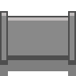

# Log Line

Controversial Contractor is a 2d top-down game about a contractor hired to build an oil pipeline. Unfortunately the pipeline is being built through the middle of a nature preserve, and the inhabitants are not very happy about it. Manage a limited budget to build defenses to stop locals from damaging the pipeline, while also attempting to meet a daily length quota.

### Article

[https://www.bbc.com/news/world-us-canada-51452217](https://www.bbc.com/news/world-us-canada-51452217)

Over the winter of 2019-20, protests erupted in Canada over the construction of a pipeline that would transport natural gas out of British Columbia, because the pipeline cuts through indigenous lands. This game is based on this conflict, except in the game the pipeline is for oil, and the sole motivator is money.

# Genre Discussion

- Base-building along a set path
- Solve basic puzzles by navigating around obstacles
- Manage object durability against onslaughts of enemies
- Manage money by only spending where absolutely essential

# Central Themes

- The anti-environmental nature of oil pipelines
- Wrongly persevering in the face of rightful adversity
- Game hopes to show that pipelines are bad and that the people who order them are selfish.

# Features

- Place pieces of pipes on available grid squares to build a pipeline from one point on the screen to another.
  - Each piece placed gives the player money at a steady rate
  - New pieces cost money to build

- Place fences to protect sections of pipe from advancing enemies
  - Each fence lasts a certain amount of time before breaking
  - When one side breaks, both sides break

- Pieces of pipe have durability
  - When enemies attack the piece its durability lowers
  - Player spends money to repair the pipes

# Gameplay Example

- Player is given a starting amount of money
- Player spends some money to buy a piece of pipe
- Player drags the piece they bought onto an empty grid space, such that one end is connected to an existing piece
- [OPTIONAL] Place fences on an existing pipe space to protect it from enemies
- [OPTIONAL] Repair damaged pipes by spending money gained during the level
- Repeat 1-4 until the pipeline goes from the start point to the end point.

Player starts with an empty field and a goal: Connect the red and green pipes with grey pipes

Player starts putting down pipes

An enemy comes in and starts attacking the pipe

Player builds a fence (orange rectangles) to stop the enemy temporarily

The fence lasted long enough for the player to quickly place down the rest of the pipes

# Screen Mockup

### Title Card

### Game

- Top-down
- Enemies come from left and right sides of the screen, the pipeline runs down the middle.
- Pipe piece options along the bottom of the screen with respective prices
- Money value on top of the pipe options bar for easy viewing

This sample screen has the following features:

- Enemies attacking the pipeline
- An almost completed pipeline (missing one piece on the bottom)
- Fences protecting individual pipes from an enemy (orange lines)
- Two immovable pipes which mark the start/end points that the pipe needs to connect to
- A water hazard that needs to be moved around
- A bar at the bottom containing all the pipes the player could place

Not shown:

- Prices for each pipe
- Fence option next to the pipes
- Health bars on the pipes/fences
- Total money value available to the player

# Art Style

- Pipes and fences will be industrial
- Surrounding environment and enemies will be colorful and natural
- Must be a contrast between player's actions and the existing environment

# Summary (why is the game fun?)

The game combines limited base-building (building a pipeline) with simple problem solving (get the pipe around obstacles without going over budget) to tell a story about the effects of oil transport on small communitites and nature. Problem solving on a grid is a fun form of gameplay, and the context is important to a lot of people. The eccentric characters and mildly comedic dialogue will also add to the fun.

# Pillars of Design

- Building: The core gameplay mechanic is building a pipeline, so everything should contribute to it.
- Make the player feel conflicted: The player is being forced to destroy a community for a money-hungry boss. They should feel conflicted between wanted to finish the job, and wanting to respect the locals and the environemnt.
- Progress in the wrong direction: The game should place emphasis on the fact that building a pipeline through a nature preserve is not a positive action, since it harms communities and the environment.

# Characters

### Ace Moneymaker

This is the player's eccentric boss. He is an oil magnate who cares only about making more money.

### Player

The player is a contractor in charge of building the pipeline. They are conflicted about their work, but see no option other than to continue.

### Locals

Throughout the later levels, waves of locals will decend on the contruction site to damage individual pieces of pipe. They are the residents of the community that the pipeline is plowing through, and they are very angry.

# Story and Setting

The story revolves around the player, a contractor who was hired by oil magnate Ace Moneymaker to build a pipeline from a new oil field to his processing plant in the North. To save costs on labor and materials, the pipeline will travel directly through a nature preserve and a small community. Moneymaker does not care about the locals, he just wants to make money.

As Moneymaker put it, "Son, do player see all that green stuff (grass)? Now do player see all that black stuff (oil)? Which one do player think will make me more money? Exactly, so if it means getting rid of the green to get the black, do it. Alright?"

The end of the game will see a news article appear showcasing nation-wide protests to the pipeline player built. At the very end player meet with the boss and are left alone in his office. There is a button on the desk: "destroy the pipeline". Do player push it, and destroy all playerr work, or do player leave it alone and keep the populus angry? There will be a very brief cutscene about playerr choice before credits roll.

# Core Mechanics

- Buy and place pieces of pipe to form a continuous pipeline from one point on the map to another
- Buy and place fences to protect the pieces of pipe from the locals
- Spend money to repair existing pipes
- Remove existing pipes for a full refund on that piece's price
  - Pipes cost money to place and repair, but not to remove

# Features Broken Down

### Buying Pipes

- Along the bottom of the screen will be squares containing icons for different pieces of pipe and their prices.
  - If the player has enough money, they can click on an icon and drag that piece onto the map.
  - Otherwise, the box will flash in a way that indicates the player is short on cash.

### Placing Pipes

- The game room is divided into a grid of squares. Pipe pieces can be placed on any square that is not marked as invalid.
  - Water, big rocks, and other pipes are all invalid places
- Once a piece is placed it cannot be moved
- A piece must have at leat one end connected to another existing piece

### Removing Pipes

- Players can choose to remove any pipe that they placed during the level for a refund
  - Damaged pipes refund a fraction of their original cost based on their health
  - Undamaged pipes give a full refund for the original price of that pipe

### Buying Fences

- Along the bottom of the screen will be one square containing an icon for a fence and its price.
  - If the player has enough money they can drag a fence onto the map
  - Otherwise, the box will flash in the same was as with pipes to indicate low cash.

### Placing Fences

- The player can click the fence icon and place it on any square occupied by a pipe that the player had previously placed.
  - One fence actually consists of two fences, one on each side of the pipe. One purchase protects both sides of the fence.
  - If one side of the fence breaks, so does the other

### Removing Fences

- Fences can be removed in the same way as pipes, with the same refund system

# Audio Styles

- This is a game about expanding a man's industrial reach, so the primary music will be industrial rock/metal.
- Placing objects will have metallic sounds, metal on metal, etc.

# Asset Production

- GIMP 2.10
- Inkscape 1.01

# Level Design

Levels will contain a start point and an end point. The player must place pieces to build a pipeline between these two points.

Later levels will have obstacles to avoid. You must go around lakes and rocks, for example.

At an early point, but not immediately, enemies will start spawning and attacking the pipes.

- In order to complete the level, the pipeline must be complete from start to end, no missing pieces. If an enemy destroys a piece, a replacement must be bought and placed.

# UI Design

- Row of boxes containing icons for each available pipe shape at the bottom of the screen
- Money value on top of this row of boxes
- Level indicator in the top right corner

# NPCs and Their Behaviours

The NPCs in this game are the locals. They will spawn off screen on the top and bottom and will slowly walk towards the pipe until they are close enough to attack it. They will stay in place until the pipe is destoyed, then they themselves will be destroyed (washed away by the oil, or something). The player cannot stop their progress, they can only delay it with fences.

# Development Tools

- Game Maker Studio 1.4

# How the Game Will Be Received

This game will be a progressive experience. The player will move through a small number of levels to reach the end of the game. It will be received as a level-driven puzzle game about the non-monetary cost of oil pipelines.

This game will be played on Windows with a mouse or trackpad. No keyboard input.

# Other Important Details (Stretch Goals, etc)

If I have time, I will try to implement the following things:

- Timers on building, repairing, and destroying so that they are not immediate operations
  - You would have a set number of 'workers', so player could only have so many pipes being built/repaired/destroyed at once.
- Different levels of pipes and fences (upgradable items)
  - A stronger, more expensive, pipe would withstand more abuse. But, it would take longer to repair.
  - A stronger, way more expensive, fence would withstand more abuse.
