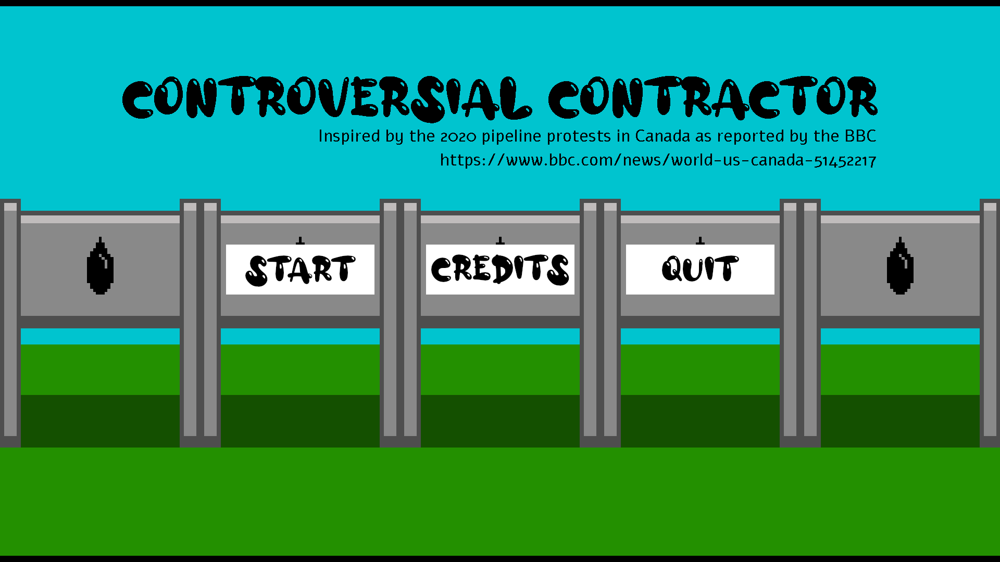
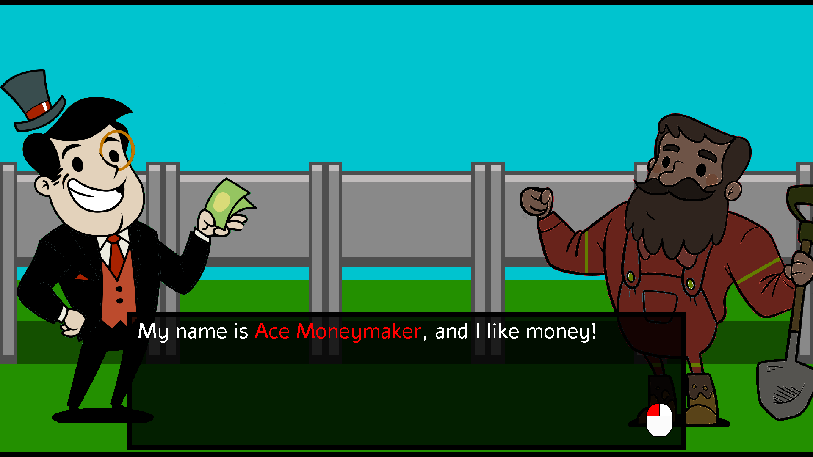
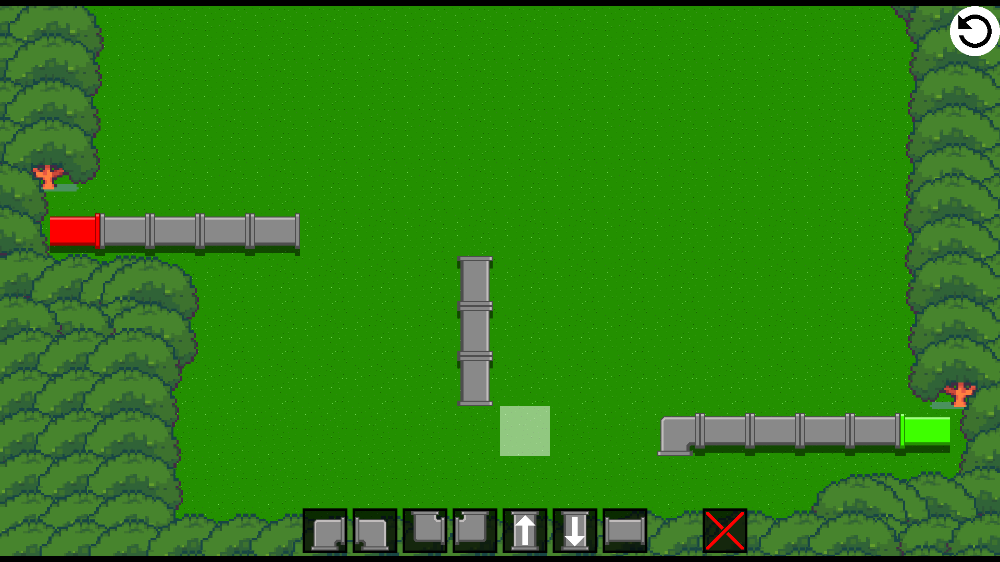
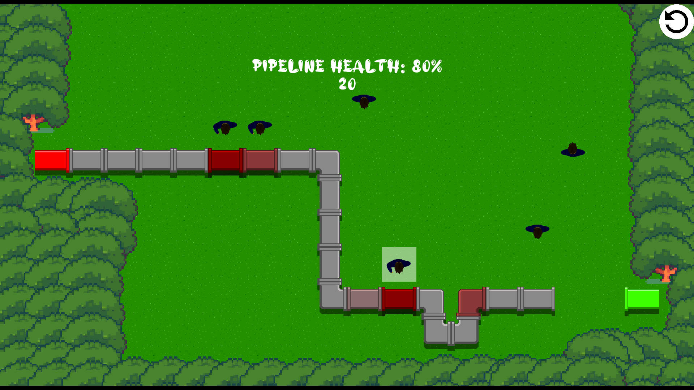
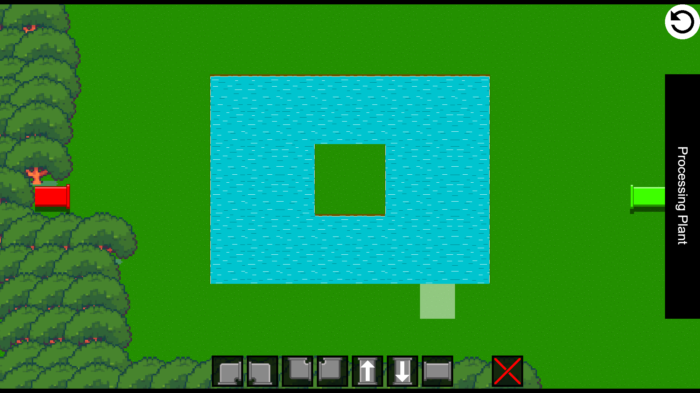

# Controversial Contractor
A game made in GameMaker Studio 1.4

Build a pipeline to transport your boss's oil to his refinery in the East. Don't let anyone get in your way!

Download the [game](https://github.com/bcout/Games/tree/main/ControversialContractor/Releases/Final) to play!

# Screenshots

# TODO

Update the documentation to match the changes made during the final crunch time.
